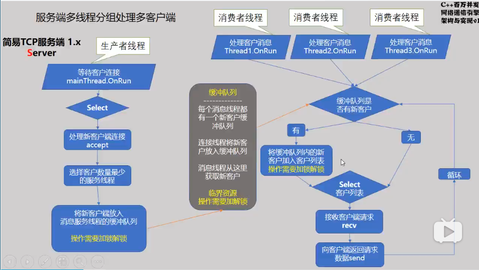

# 线程

实质：一个运行的函数

进程实质：一个运行的程序，程序中至少有一个函数（main函数）

详情见：【APUE-NOTES/04.多线程、信号.md】


常用命令：

- `ps -Lf pid`：查看指定进程的所有线程（LWP是线程号）

- `ps axm`：查看进程的详细信息，`- -`表示一个线程
- `ps ax -L`：以Linux关系查看进程和线程的关系，在Liunx中，是用PID来标识线程的（线程占用PID）


# C++ 标准线程库

```c++
#include<thread>
```

编译时，需要加上编译选项`-pthread`

> 示例：【./05.thread/hellothread/thread1.cpp】


## 创建线程

```c++
thread t(线程函数， 函数参数);
```

## 启动线程

```C++
t.detach();	// 启动，并分离线程
t.join();	// 启动，并等待线程执行完毕，收尸
```

## 互斥锁

```c++
#include<mutex>

mutex mut;
mut.lock();		// 加锁
mut.unlock();	// 解锁
```

缺点：频繁使用锁，会加大系统开销

### 自解锁

有时候代码突然跳出临界区时，忘记解锁了，很有可能造成阻塞，因此可以使用自解锁

当运行到自解锁时，自动加锁；当执行完作用域的代码时，自动解锁

```c++
<mutext> mut;

int Thread(int t_id)
{
    for (int i = 0; i < 10000000; i++)
    {
        // 启动自解锁
        lock_guard<mutex> lg(mut);
        sum++;
    } 
}
```

优点：会自动解锁，不必过于担心逻辑出错

缺点：消耗比互斥锁大

## 原子操作

- 一段代码要么不执行，要么全部执行，执行过程中不能被打断
- 一个原子变量只能有一个线程来操作

```c++
#include<atomic>

atomic_int sum; //定义一个原子，这个原子只能被一个线程操作
// atomic<int> sum;
int Thread(int t_id)
{
    for (int i = 0; i < 10000000; i++)
    {
        sum++;	// sum 是原子变量，不需要进行加锁了
    } 
}
```

优点：开销比锁小


# 实例：升级Select模型

【./05.thread】

客户端：

- *建立10000个客户端连接，使用4个线程*
- 给每个线程分配250个客户端，用于处理客户端的操作
- 客户端的操作仅为向服务器循环发送数


==服务端：==

- 有1000个客户端待连接

- 使用多 个线程，一个线程用于处理连接请求，其他线程处理客户端消息

  

