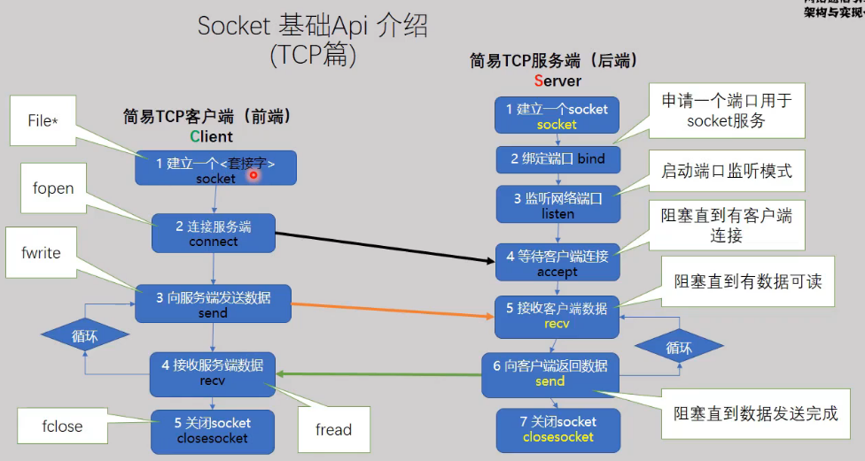

# TCP服务端

- 1、`socket()`建立一个socket
- 2、`bind()`**绑定一个端口用于服务端的socket服务**

- 3、`listen()`监听网络端口号
- 4、`accept()`接受客户端发起的（connect）连接请求，**返回客户端的socket**
- 5、`send()`向客户端发送一条数据
- 6、`close()`关闭socket


# TCP客户端

- 1、`socket()`建立一个socket
- 2、`connect()`发起请求，连接服务器
- 3、`recv()`接收服务端发送的数据
- 4、`close()`关闭socket


> 【示例1】./hellosocket/easysocet1
>
> 【示例2】./hellosocket/easysocet2


==注意！！！==

==**客户端和服务端进行数据的传输时，都是在客户端的socket上进行读/写操作的**==


# 发送结构化数据

## 发送结构体类型的数据

以数据结构体的形式在网络中传输

**为保证在不同平台的正常通信，需要为服务端和客户端制定通信协议**

- 数据类型使用`uint_t`型
- 大端字节序需要转换为小端字节序（`htons`;`htonl`;`ntohs`;`ntohl`）
- 内存地址不对齐（结构体长度就是各个变量的长度和）

```c
struct msg_st
{
    uint8_t name[NAMESIZE];    // 数据类型
    uint32_t math;
    uint32_t chinese;
}__attribute__((packed));   // 内存地址不对齐
```


> 【示例】./hellosocket/easysocket3


## ==发送网络报文==

网络数据报文的格式定义

- 报文有两个部分，包头和包体，是网络消息的基本单元
- 包头：描述本次==消息包的大小（长度）==，描述数据的作用
- 包体：数据


数据传输顺序：先发送包头，再发送包体


> 【示例】./hellosocket/easysocket4/datapackage1


### 合成包头包体

包体**继承**包头，就完成了数据包的封装

> 【示例】./hellosocket/easysocket4/datapackage2


# ==粘包、少包==

粘包：正常一次传输500B，但是因为网络状况，某一次接收到了1000B的数据，发送了两个数据包但是一次性接收到了，这就是粘包现象

解决方法：拆包，将1000B的数据拆分成两个消息


少包：正常一次传输1000B，但是因为网络状况，某一次只接收到了500B的数据，数据包没有接收完，这就是少包现象

解决方法：需要在包头中定义一个数据包长度，当接收到的数据达到这个长度时，才表示接收完数据


## 原理

前提：socket指向内核中的两个缓冲区（读/写缓冲区）


发送端：使用`send()/write()`发送一段数据，发送缓冲区（写缓冲区）存储着要发送的数据

**经过网络传输层传输缓冲区的数据**

接收端：接收缓冲区（读缓冲区）存储着发送端发送的数据，使用`recv()/read()`从接收缓冲区读取一段数据


在传输时，会出现以下情况：

当发送端不断的快速发送数据，接收缓冲区很快填满，而接收端每次只`recv`一段的数据，且**接收速度小于发送速度**，此时缓冲区溢出，发送端无法发送数据，造成网络阻塞现象


最好的情况是：

缓冲区有多少数据，接收端就尽快的将这些数据读取出来


==实现方法：==

借助**第二缓冲区**，即定义一个足够大的缓冲区，将`recv()`从接收缓冲区读取的数据存放到这个第二缓冲区中

```c++
char szRecv[40960];
int len = recv(fd, szRecv, 40960, 0);
```


==存在问题：==

将接收缓冲区的所有数据存放到第二缓冲区后，接收缓冲区虽然被及时清空了，但是第二缓冲区中的数据可能是粘包或少包的，即无法区分这些数据是来自于哪一个socket，因此需要**解决粘包或少包的问题**


## 解决客户端粘包、少包

定义一个第二缓冲区A，存放`recv()`接收的数据

定义一个缓冲区B（远大于缓冲区A），将第二缓冲区A中的数据拷贝到缓冲区B中

==注意：==

- 拷贝的长度是真实接收到的长度
- 拷贝时，缓冲区B中的数据是append（因此需要记录每一次拷贝后缓冲区B的长度）

> 详情见：./object_oriented/EasyTcpClient.hpp

```c++
char szRecv[10240];
char msgBuf[10240*10];
int lastPos = 0;	// 记录msgBuf有效字符串长度

// 接收数据
int recvData(int cfd)
{
    // 接收服务端发送的数据，存放到第二缓冲区 szRecv
    int len = recv(cfd, &szRecv, 10240, 0);
    if (len <= 0)
    {
        printf("client【%d】 quit\n", cfd);
        return -1;
    }
    printf("len=%d\n", len);
    // 将第二缓冲区读取到的数据append到缓冲区msgBuf
    	memcpy(msgBuf+lastPos, szRecv, len);
    // 更新msgBuf的数据长度
    lastPos += len;
    // 循环判断缓冲区的数据是否大于消息头（粘包：可能发送多个数据包）
    while (lastPos > sizeof(DataHeader))
    {
        // 将缓冲区的数据类型转换为消息头类型
        DataHeader *header = (DataHeader *)msgBuf;
        // 
        if (lastPos > header->dataLength)
        {
            lastPos -= header->dataLength;
            OnNetMsg(header);
            // 处理完一个完整数据包后，将缓冲区的数据前移
            memcpy(msgBuf, msgBuf+header->dataLength, lastPos);
        }
        else	//少包，跳出循环
			break;
    }
}
```


## 解决服务端粘包、少包

对于客户端而言，它与服务端是一对一的关系，因此只需要建立2个缓冲区

对于服务端而言，它与客户端是一对多的关系，因此需要为每个客户端建立2个缓冲区


==方法：== **将客户端的socket封装成一个对象，里面包含socket、缓冲区、lastPos**

> 详情见：./object_oriented/EasyTcpServer.hpp

