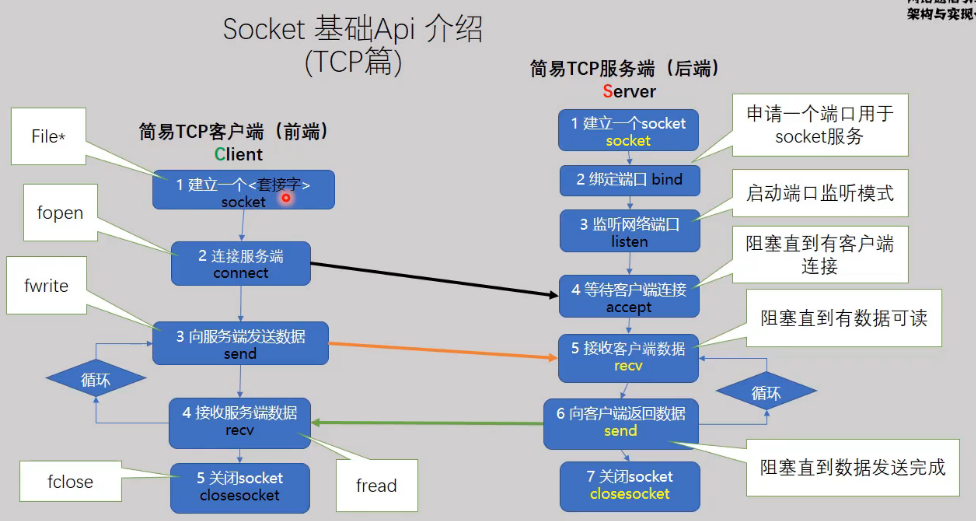

# TCP服务端

- 1、`socket()`建立一个socket
- 2、`bind()`**绑定一个端口用于服务端的socket服务**

- 3、`listen()`监听网络端口号
- 4、`accept()`接受客户端发起的（connect）连接请求
- 5、`send()`向客户端发送一条数据
- 6、`close()`关闭socket


# TCP客户端

- 1、`socket()`建立一个socket
- 2、`connect()`发起请求，连接服务器
- 3、`recv()`接收服务端发送的数据
- 4、`close()`关闭socket


> 【示例1】./hellosocket/easysocet1
>
> 【示例2】./hellosocket/easysocet2


# 发送结构化数据


## 发送结构体类型的数据

以数据结构体的形式在网络中传输

**为保证在不同平台的正常通信，需要为服务端和客户端制定通信协议**

- 数据类型使用`uint_t`型
- 大端字节序需要转换为小端字节序（`htons`;`htonl`;`ntohs`;`ntohl`）
- 内存地址不对齐（结构体长度就是各个变量的长度和）

```c
struct msg_st
{
    uint8_t name[NAMESIZE];    // 数据类型
    uint32_t math;
    uint32_t chinese;
}__attribute__((packed));   // 内存地址不对齐
```


> 【示例】./hellosocket/easysocket3


## ==发送网络报文==

网络数据报文的格式定义

- 报文有两个部分，包头和包体，是网络消息的基本单元
- 包头：描述本次消息包的大小（长度），描述数据的作用
- 包体：数据


数据传输顺序：先发送包头，再发送包体


> 【示例】./hellosocket/easysocket4